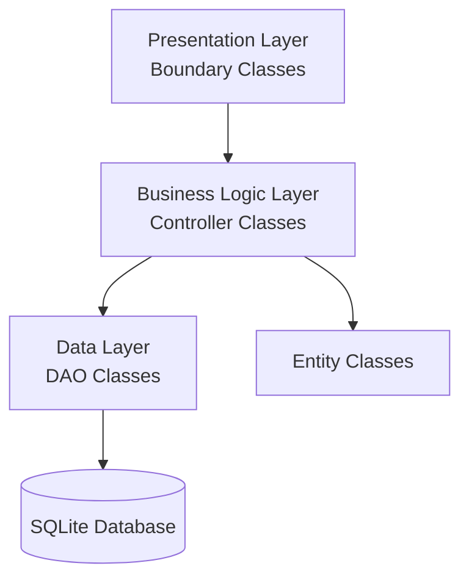

# Application Architecture

## 3-Layer Architecture



## Package Structure

```
org.flightreservation
├── entity
│   ├── Aircraft.java
│   ├── Customer.java
│   ├── Flight.java
│   ├── Payment.java
│   ├── Reservation.java
│   └── User.java
├── controller
│   ├── AircraftController.java
│   ├── AuthenticationController.java
│   ├── CustomerController.java
│   ├── FlightController.java
│   ├── PaymentController.java
│   └── ReservationController.java
├── data
│   ├── AircraftDAO.java
│   ├── CustomerDAO.java
│   ├── DataInitializer.java
│   ├── DatabaseManager.java
│   ├── FlightDAO.java
│   ├── PaymentDAO.java
│   ├── ReservationDAO.java
│   └── UserDAO.java
└── boundary
    ├── AdminFlightManagementView.java
    ├── BookingView.java
    ├── CustomerManagementView.java
    ├── LoginView.java
    ├── MainMenuView.java
    ├── ReservationManagementView.java
    └── SearchFlightView.java

org.reservation
└── Main.java
```

## Class Diagram (Simplified)

```mermaid
classDiagram
    class User {
        -id: int
        -username: String
        -password: String
        -role: String
    }
    
    class Customer {
        -id: int
        -firstName: String
        -lastName: String
        -email: String
        -phone: String
        -address: String
    }
    
    class Aircraft {
        -id: int
        -model: String
        -capacity: int
        -airline: String
    }
    
    class Flight {
        -id: int
        -flightNumber: String
        -origin: String
        -destination: String
        -departureTime: LocalDateTime
        -arrivalTime: LocalDateTime
        -price: double
        -aircraftId: int
        -availableSeats: int
    }
    
    class Reservation {
        -id: int
        -customerId: int
        -flightId: int
        -reservationDate: LocalDateTime
        -numberOfPassengers: int
        -status: String
    }
    
    class Payment {
        -id: int
        -reservationId: int
        -amount: double
        -paymentDate: LocalDateTime
        -paymentMethod: String
        -status: String
    }
    
    class DatabaseManager {
        -instance: DatabaseManager
        -connection: Connection
        +getInstance() DatabaseManager
        +getConnection() Connection
    }
    
    class UserDAO {
        -dbManager: DatabaseManager
        +findByUsername(username: String) User
        +save(user: User) boolean
        +findAll() List~User~
        +update(user: User) boolean
        +delete(id: int) boolean
    }
    
    class CustomerDAO {
        -dbManager: DatabaseManager
        +findById(id: int) Customer
        +findByEmail(email: String) Customer
        +save(customer: Customer) boolean
        +findAll() List~Customer~
        +update(customer: Customer) boolean
        +delete(id: int) boolean
    }
    
    class FlightDAO {
        -dbManager: DatabaseManager
        +findById(id: int) Flight
        +searchFlights(origin: String, destination: String, date: String) List~Flight~
        +save(flight: Flight) boolean
        +findAll() List~Flight~
        +update(flight: Flight) boolean
        +delete(id: int) boolean
    }
    
    class ReservationDAO {
        -dbManager: DatabaseManager
        +findById(id: int) Reservation
        +findByCustomerId(customerId: int) List~Reservation~
        +save(reservation: Reservation) boolean
        +findAll() List~Reservation~
        +update(reservation: Reservation) boolean
        +delete(id: int) boolean
    }
    
    class PaymentDAO {
        -dbManager: DatabaseManager
        +findById(id: int) Payment
        +findByReservationId(reservationId: int) Payment
        +save(payment: Payment) boolean
        +findAll() List~Payment~
        +update(payment: Payment) boolean
        +delete(id: int) boolean
    }
    
    class AircraftDAO {
        -dbManager: DatabaseManager
        +findById(id: int) Aircraft
        +save(aircraft: Aircraft) boolean
        +findAll() List~Aircraft~
        +update(aircraft: Aircraft) boolean
        +delete(id: int) boolean
    }
    
    class AuthenticationController {
        -userDAO: UserDAO
        +authenticate(username: String, password: String) User
        +registerUser(user: User) boolean
    }
    
    class CustomerController {
        -customerDAO: CustomerDAO
        +addCustomer(customer: Customer) boolean
        +updateCustomer(customer: Customer) boolean
        +getCustomerById(id: int) Customer
        +getAllCustomers() List~Customer~
        +deleteCustomer(id: int) boolean
    }
    
    class FlightController {
        -flightDAO: FlightDAO
        +addFlight(flight: Flight) boolean
        +updateFlight(flight: Flight) boolean
        +getFlightById(id: int) Flight
        +searchFlights(origin: String, destination: String, date: String) List~Flight~
        +getAllFlights() List~Flight~
        +deleteFlight(id: int) boolean
    }
    
    class ReservationController {
        -reservationDAO: ReservationDAO
        +makeReservation(reservation: Reservation) boolean
        +updateReservation(reservation: Reservation) boolean
        +getReservationById(id: int) Reservation
        +getReservationsByCustomerId(customerId: int) List~Reservation~
        +getAllReservations() List~Reservation~
        +cancelReservation(id: int) boolean
    }
    
    class PaymentController {
        -paymentDAO: PaymentDAO
        +processPayment(payment: Payment) boolean
        +updatePayment(payment: Payment) boolean
        +getPaymentById(id: int) Payment
        +getPaymentByReservationId(reservationId: int) Payment
        +getAllPayments() List~Payment~
        +cancelPayment(id: int) boolean
    }
    
    class AircraftController {
        -aircraftDAO: AircraftDAO
        +addAircraft(aircraft: Aircraft) boolean
        +updateAircraft(aircraft: Aircraft) boolean
        +getAircraftById(id: int) Aircraft
        +getAllAircrafts() List~Aircraft~
        +deleteAircraft(id: int) boolean
    }
    
    class LoginView {
        -usernameField: JTextField
        -passwordField: JPasswordField
        -loginButton: JButton
        -authController: AuthenticationController
        -login()
    }
    
    class MainMenuView {
        -currentUser: User
        -searchFlightButton: JButton
        -bookFlightButton: JButton
        -manageReservationsButton: JButton
        -customerManagementButton: JButton
        -flightManagementButton: JButton
        -logoutButton: JButton
        -setPermissions()
        -openSearchFlightView()
        -openBookingView()
        -openReservationManagementView()
        -openCustomerManagementView()
        -openAdminFlightManagementView()
        -logout()
    }
    
    UserDAO --> User
    CustomerDAO --> Customer
    FlightDAO --> Flight
    ReservationDAO --> Reservation
    PaymentDAO --> Payment
    AircraftDAO --> Aircraft
    
    AuthenticationController --> UserDAO
    CustomerController --> CustomerDAO
    FlightController --> FlightDAO
    ReservationController --> ReservationDAO
    PaymentController --> PaymentDAO
    AircraftController --> AircraftDAO
    
    LoginView --> AuthenticationController
    MainMenuView --> LoginView
    
    DatabaseManager --> UserDAO
    DatabaseManager --> CustomerDAO
    DatabaseManager --> FlightDAO
    DatabaseManager --> ReservationDAO
    DatabaseManager --> PaymentDAO
    DatabaseManager --> AircraftDAO
```

